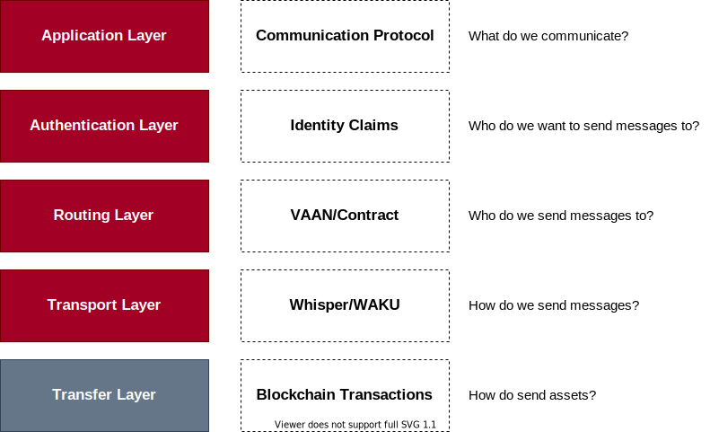

# OpenVASP Java Client

[](https://open.vscode.dev/OpenVASP/openvasp-java-client)

## TODOs

> Determine tests coverage
> Where does the VASP.abi come from?

This is a reference implementation of a Java client for the OpenVASP standard.

> Standardization is the process of implementing and developing technical standards based on the consensus of different parties that include
> firms, users, interest groups, standards organizations and governments.
>
> - Wikipedia

## What is OpenVASP?

**VASP** stands for *Virtual Asset Service Provider*.
OpenVASP is an open protocol to implement FATF's travel rule for virtual assets.

The protocol facilitates robust compliance for VASPs, solely based on a set of principles, regardless of jurisdiction or virtual asset and without membership or registration with a centralized third-party.

[Old Whitepaper](https://openvasp.org/wp-content/uploads/2020/09/OpenVasp_Whitepaper.pdf) | [Read more →](https://www.openvasp.org/)

> The current implementation only includes the Whitepaper specs.
> [OVIPs](https://github.com/OpenVASP/ovips) (OpenVASP Improvement Proposals) are currently not implemented, but they are in the roadmap.
> The OVIPs were under heavy changes since the inception of the Whitepaper.
> OVIPs were created at the end of current implementation.
>
> Client exists as an initial working implementation (packaged as a .NET library).
> The `openvasp-csharp-client` repo is heavily outdated
> <https://github.com/OpenVASP/openvasp-csharp-client>

## Reference architecture




### Main Components

- **OpenVASP Client**.
It is the main artifact that implements the OpenVASP the protocol.
It is a redistributable Java library.
Core of **OpenVASP Client** exchanges messages as described in the white paper using the Whisper/WAKU protocol.
The **OpenVASP Client** uses the Java `web3j` RPC-JSON client to connect to Ethereum.
- **OpenVASP Host**.
It is a companion demo application.
Its only purpose is to showcase the **OpenVASP Client** to customers.
That is, it serves as an example of how to use the **OpenVASP Client**.
It contains a support persistance layer, *e.g.*, banking application.
- **OpenVASP UI**.
Javascript web application (Angular.js) using the **OpenVASP Host**.
- **Smart Contracts**.
Ethereum Smart Contracts written in Solidity.
These Smart Contracts are only used for VASPs registration, *i.e.*, only for identity claims.s
The most important piece of information provided by the Smart Contracts is the VASP's public encryption key.
Moreover, they also provide metadata related VASP information, such as address, postal code, and so on.

## Getting started

This is a Maven project that can be easily reused.

### How to build

```sh
mvn compile
```

Compiled classes and generated source code will be under the `target/` folder.

The Client uses the `web3j` plugin to generate a Java stub to invoke the Smart Contracts.
The ABI (Application Binary Interface) of the contracts is located in:

```text
src/main/resources/VASP.abi
```

And the generated stub is generated in

```text
target/generated-sources/web3j/java/org/openvasp/client/contract/VASP.java
```

For more information on stub generation for smart contracts see
<http://docs.web3j.io/latest/command_line_tools/#generated-javakotlin-project-structure>

### Test

As a Maven project, just run

```sh
mvn test
```

### Local deployment

Originator/Beneficiary roles provided by java-host.

Ethereum server/geth (Golang) needed to provide Whisper & Smart Contracts.

### Encryption in Java

Use of <https://downloads.bouncycastle.org/fips-java/BC-FJA-UserGuide-1.0.2.pdf>
The dependency tree contains this dependency as part of `web3j`.

```sh
mvn dependency:tree
```

```sh
...
[INFO] +- org.web3j:core:jar:4.5.18:compile
[INFO] |  +- org.web3j:abi:jar:4.5.18:compile
[INFO] |  |  \- org.web3j:utils:jar:4.5.18:compile
[INFO] |  |     \- org.bouncycastle:bcprov-jdk15on:jar:1.65:compile <<--
...
```

## Contributing

Want to help build this project? Check out our [contributing documentation](CONTRIBUTING.md).

## License

This project is licensed under the terms of the MIT License (see the file [LICENSE](LICENSE)).
