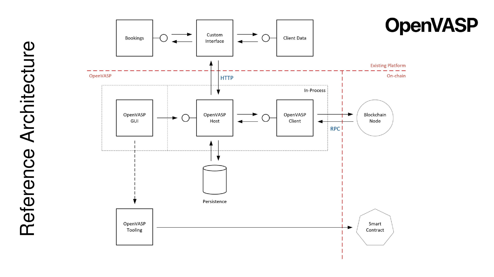
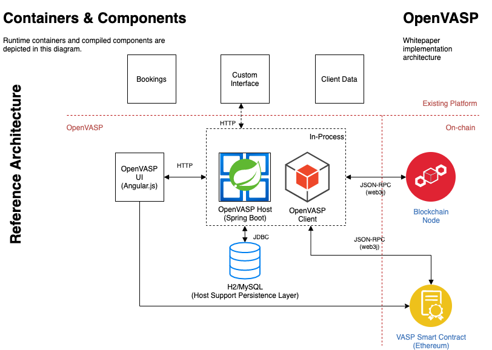
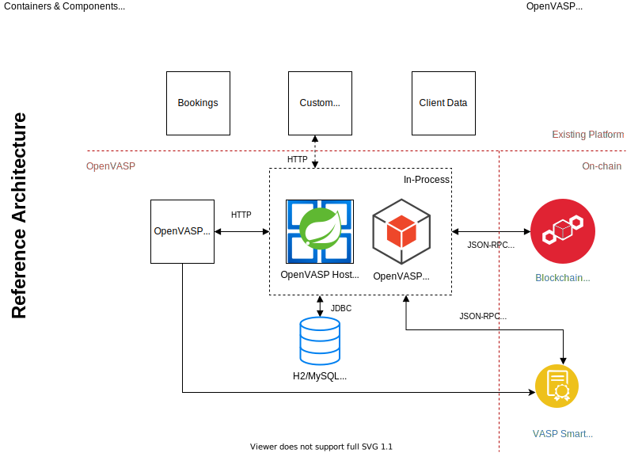

# OpenVASP Java Client

This is a reference implementation of a Java client for the OpenVASP standard.

## OpenVASP

Open protocol to implement FATF's travel rule for virtual assets.

The protocol facilitates robust compliance for VASPs, solely based on a set of principles, regardless of jurisdiction or virtual asset and without membership or registration with a centralized third-party.

[Whitepaper](doc/OpenVasp_Whitepaper.pdf) | [Read more →](https://www.openvasp.org/)

### Reference architecture



[Read more →](doc/reference-architecture.pdf)





## Getting started

This is a Maven project.

### How to build

```sh
mvn compile
```

Compiled classes and generated source code will be under the `target/` folder.

```text
target/generated-sources/web3j/java/org/openvasp/client/contract/VASP.java
```

Generates a stub to use the contract.

## Contributing

Want to help build this project? Check out our [contributing documentation](CONTRIBUTING.md).

## License

This project is licensed under the terms of the MIT License (see the file [LICENSE](LICENSE)).
